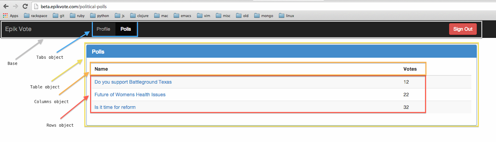

**Table of Contents**  *generated with [DocToc](http://doctoc.herokuapp.com/)*

- [Overview](#overview)
- [I have no idea what I'm doing.](#i-have-no-idea-what-i'm-doing)
	- [NPM](#npm)
- [I have some experience using Node.](#i-have-some-experience-using-node)
	- [Selenium](#selenium)
	- [Grunt](#grunt)
- [I have no idea how to write page objects.](#i-have-no-idea-how-to-write-page-objects)
- [I haven't written page objects in Javascript.](#i-haven't-written-page-objects-in-javascript)
- [Deconstructing a page.](#deconstructing-a-page)
	- [Our sample page](#our-sample-page)
	- [Base](#base)
	- [Table](#table)
	- [Columns](#columns)
	- [Rows](#rows)
	- [Tabs](#tabs)
- [About this Tutorial](#about-this-tutorial)

## Overview

This is going to cover the basics of writing page objects in an Angular app using Protractor. I am going to assume you are brand new to the Node stack, and will walk you through setting that up. For those who are already familiar with Node, Protractor, and the page object model, you may want to jump ahead to the part where we [talk about page objects in Protractor](#deconstructing-a-page).

## I have no idea what I'm doing.

That's Ok. Start here by downloading node:

Download for [Windows](http://nodejs.org/download/).
  > **NOTE**: this tutorial should, in theory, work with Windows ([**not** Cygwin](https://npmjs.org/doc/README.html#Installing-on-Cygwin)). However, I can't any make guarantees about that. Use at your own risk.

For Mac:
  - Get [`brew`](http://brew.sh/).
  - `brew install npm` (brew includes node when you install npm)

For [Linux](https://github.com/joyent/node/wiki/Installing-Node.js-via-package-manager#ubuntu-mint-elementary-os).
  > **NOTE**: you will need to follow the instructions included above for updating your aptitude repositories to use Protractor.

### NPM

[`npm`](https://npmjs.org/doc/README.html) is the *Node package manager*, and gets helpful stuff for you.

Node projects are all self-contained. You keep their dependencies (listed in the `node_modules` directory) isolated from your other projects. This is a Good Thing.

Usually, you don't want to have node modules installed *globally*, meaning they are available everywhere. Some exceptions are listed below. Run this command to get command-line access to these applications:

    npm install -g grunt-cli protractor jshint karma

And then install this project's dependencies locally:

    npm install .

You will have all dependencies in this project's [`package.json`](./package.json) file installed in your `node_modules` file.

Double check that your `$PATH` variable is set up correctly for node:

    which grunt

If you don't see anything, you need to edit your `~/.bashrc` or `~/.bash_profile` and add this line:

    PATH=$PATH:/usr/local/share/npm/bin

Then run `source ~/.bash_profile` to update your system's path. Then try `which grunt` again.

It should look like this:

```bash
$> which grunt
/usr/local/bin/grunt
```

> **PROTIP**: If this still isn't working, you may have added the wrong location to your `PATH` variable. Check out [this suggestion](http://stackoverflow.com/a/16635816/881224) to see what the correct `PATH` entry should be.

## I have some experience using Node.

Ok. Make sure you have Protractor available globally. Use `npm install -g protractor` to achieve this.

### Selenium

Once you've installed all the dependencies for this project, the next piece to getting set up is to get a selenium webserver running on your system. Here's how to do this:

1. Download the [`selenium-server-standalone.jar`](https://code.google.com/p/selenium/downloads/list) file found on this page.
2. Figure out where you downloaded it (usually, this is in your home directory, under "Downloads").
3. Start a selenium server with something like this command:

```bash
$>: java -jar ~/Downloads/selenium-server-standalone-V.vv.x.jar
```

> **NOTE**: `V.vv.x` is the version of your jarfile that you downloaded. Don't copy and paste this line.

> - Another note: it may be helpful for you to create an [alias](http://askubuntu.com/a/17537/159262) to this command, as you'll use it frequently.

Once you run this command, it becomes a dedicated process that will use up your terminal. Just leave it be and open a new terminal window to continue working.

### Grunt

[`grunt`](http://gruntjs.com/) is a task runner for node projects. If you've used ruby, it's like `rake`. If you're coming from python, it's a lot like `paver`. If you're brand new to programming, it's a tool that describes complex actions, and shortens them into easy to type one-liners. The one we'll use is

    grunt test:mid

If all works well, you should see the following output:

```bash
$>: grunt test:mid
Running "test:mid" (test) task

Running "shell:protractor" (shell) task
Command: protractor test/protractor.conf.js
Using the selenium server at http://localhost:4444/wd/hub
.

Finished in 1.339 seconds
1 test, 1 assertion, 0 failures


Done, without errors.
```

> **PROTIP**: if you get an error, and your traceback is really short and unhelpful, try running `protractor test/protractor.conf.js` directly. You'll tend to get an exact location of syntax errors that way.

## I have no idea how to write page objects.

Page objects are, in essence, a way of [deconstructing a website's user interface into an API](http://martinfowler.com/bliki/PageObject.html) that represents what a user might do using that website. For instance, a good example of a high level protractor test might look like this:

```javascript
it('should jump forward to page 7 using pagination', function() {
    pagination.jumpToPage(7);
    expect(pagination.getCurrentPageNumber()).toEqual(7);
});

it('should jump backward to page 2 using pagination', function() {
    pagination.jumpToPage(2);
    expect(pagination.getCurrentPageNumber()).toEqual(2);
});

it('should navigate forward one page at a time', function() {
    pagination.nextPage();
    expect(pagination.getCurrentPageNumber()).toEqual(3);
});

it('should navigate backwards one page at a time', function() {
    pagination.previousPage();
    pagination.previousPage();
    expect(pagination.getCurrentPageNumber()).toEqual(1);
});
```

The intent of these tests are clear, and easy to follow. Also, if the way pagination is handled changes, these tests won't break as long as these functions still deliver on this functionality. Maintainence becomes a much simpler task when you abstract over the low-level details of a page.

## I haven't written page objects in Javascript.

If you've written page objects before, you might have done so using java or ruby, two very popular languages for doing this task in. Javascript is a bit different; the Selenium port of WebDriver to javascript uses an [asynchronous](https://code.google.com/p/selenium/wiki/WebDriverJs#Promises) paradigm, and at first can be very confusing to look at.

Here's a basic example, and one you'll see everywhere in this tutorial:

```javascript
return this.lblResultCount.getText().then(function (countText) {
    return parseInt(countText.split(' ')[0], 10);
});
```

Here's what happens:
  - Let's say that `lblResultCount`'s text looks like *"241 Results found this search"*.
  - The first line says, `return` the text of the results count, `then` pass that text in as `countText`.
  - Finally, return an integer representing the first word of the text (in this case, 241).

You can chain together these *promises* as deep as you need to. As you become comfortable with this chaining, we'll start to leverage it as nested calls to deconstruct a page into simple components that are easy to organize and manage as your test base grows.

## Deconstructing a page.

Despite the name *page* objects, a page object isn't an *entire* page; there are many page objects on a page, and defining them requires that we explore the application a bit by hand, and look for similarities between the different pages. Anything that gets repeated over many pages needs to be stored seperately. Then we combine them together when we go to write the actual tests.

For instance, here's a screencap of a page that we'll be dissecting later in this tutorial, highlighted for clarity.

### Our sample page



Let's go through and define each of these page objects, and see if we can't mock them out in an outline first:

### Base

The constant *"Epik Vote"* link takes the user to the home page, and the Sign Out button is always visible not matter where a user goes. This bar should be considered our "Base" object (even though it doesn't do much of anything).

You may have noticed that in the Base object, there's no "Sign Out Button" object, or "Epik Vote" object. The reason for that is because Selenium provides great utilities for interacting with images, links, buttons, and so on. These elements are already as simple as they need to be. Abstracting over these elements any further would be a waste of time, and add unneeded complexity to the project. We're going to focus on the objects on our page that deliver information to the user. These are typically more complex, and require more attention.

### Table

This table actually has very little going on in and of itself. It's what's inside the table that is interesting to us. We'll probably just denote how to find the table, and reference that in our Columns and Rows objects.

### Columns

Just like with tabs, you don't want to denote your columns by their index. Name them instead. If they support sorting, they'll need a `.sort()` method, perhaps taking an argument to designate what direction the sort should be in. Some other properties of a column might be `name`, `text`, `data`, and other convenience methods.

### Rows

Unlike columns and tabs, we don't want to name our rows, since there's nothing we can name them by reliably. Our rows will be an array since we can't predict what *all* of the rows are going to look like, but we can know what *each* row will look like. We should focus on that instead:

```javascript

it('should have data in the first row', function () {
    rows.getRowByNumber(1).then(function (row) {
        row.name.then(function (name) {
            expect(name).toEqual('Do you support Battleground Texas');
        });
        row.link.then(function (link) {
            expect(link).toEqual('/political-polls/do-you-support-battleground-texas')
        });
        row.votes.then(function (votes) {
            expect(votes).toBeGreaterThan(0);
        });
        row.isVisited().then(function (result) {
            expect(result).toBe(false);
        });
    });
});
```

### Tabs

There are a few ways you could construct this tab object.

One way looks like this, and admittedly, I've seen it a lot:

```javascript
it('should have tabs', function () {
    tabs[0].click();
    expect(tabs[1].getText()).toEqual('Polls');
});
```

This works for now, but I don't like it because it treats the tabs like they're in a list. That means if a tab element ever gets removed, it may break lots of tests in many places because `tabs[1]` isn't there anymore. I'll show you how to do it more like this:

```javascript
it('should have tabs', function () {
    tabs.getTabs().then(function (tabs) {
        tabs.profile.then(function (profileTab) {
            profileTab.visit();
        });
        tabs.polls.then(function (pollsTab) {
            expect(pollsTab.name).toEqual('Polls');
        });
    });
});
```

As you can see, a tabs *object* is much more flexible. It becomes easier to update the definition of the object itself, and keep the references to the object symantically intact. It always helps to try and drive around an app by something *you* define, instead of relying on the way the page looks or is structured.

## About this Tutorial

This tutorial will be broken up into various sections. This is just "Chapter 0" of the tutorial. You'll need to continue to learn more about how to construct these page objects using Astrolabe, a utility that keeps our page objects neat and tidy for us.

To continue this tutorial, checkout the branch `chapter-1` via the command line:

    $> git checkout -b chapter-1 origin/chapter-1

Or just [jump to it in your browser](../chapter-1/README.md).

And we'll start defining our first pages, and write our first test.
