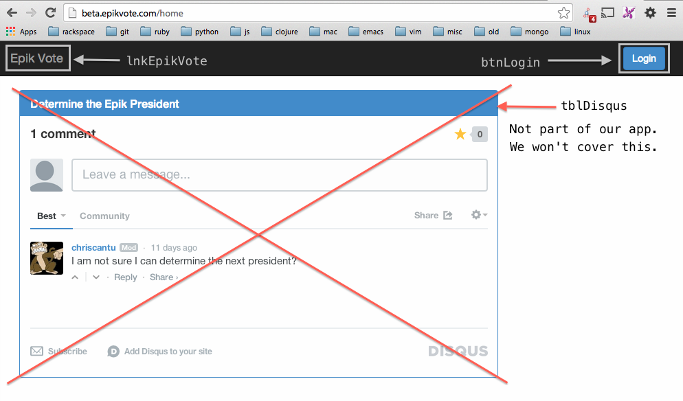

# Chapter 2 - The Front Page

We're going to start by defining the first page we see when arriving on our site, the front page.

Visit http://beta.epikvote.com to view the first page, which only supports a login button. We'll define our base elements, and use them to navigate to the actual login page.

## Before we begin...

I want to preface this with a warning: some of this page object code is *boilerplate*, meaning it's repetetive and tedious. I wouldn't recommend typing it out by hand, unless you really want to. I certainly don't! I use some [snippets for my editor](https://github.com/Droogans/.emacs.d/tree/mac/snippets/js-mode/astrolabe) to greatly speed up this process. Those three are a good place to start.

I highly recommend figuring out [how to add snippets to your editor](http://docs.sublimetext.info/en/sublime-text-3/extensibility/snippets.html), and including those three before we begin.

## Writing our first page object

Here's a preview of the page we're going to outline, and what we'll be defining:

## The base page

A couple of things to note here:

  - `tblDisqus` is a plugin from the Disqus website. If there's an issue with it, it's not our responsibility to fix it. You can write tests against it if you want to, but it should probably be done last. We have our own app to worry about.
  - I prepended `lnk` in front of the link element, and `btn` in front of the button element. This is for:
    - organizing our page elements in our page
      - keep these elements *alphabetically* sorted
      - this is *especially* important when working with a team.

Here's a list of recommended prefixes that I use when defining page elements:

## Recommended page element prefixes

`btn` -- Button

`chk` -- Checkbox
 - This refers to an individual box, not a collection of checkboxes. It can be checked/unchecked.
 - Similar to a `rad` element, except that you can select more than one checkbox.

`ele` -- Element
 - This is a very generic "element" element. Use this when you're not sure your element doesn't fit nicely into another category.
 - Many times, `ele` elements are passed into functions that construct objects that make working with the page simpler.

`img` -- Image
 - Images can have link-like properties, but if it has a picture there, it's probably an image. Go with what a user is going to refer to an element as.

`lbl` -- Label
 - Literally just text on a screen. Has no interactive functionality.

`lnk` -- Link

`rad` -- Radio
 - This refers to a single radio button, not a collection of them. It can be enabled/disabled.
 - Similar to a `chk` element, except that only one radio button can be enabled in a given set of options at a time.

`sel` -- Selection
 - A dropdown list. I sometimes call these `lst` for lists.

`tbl` -- Table
 - A table is a group of just about anything. It encompasses a lot, and they get used frequently.
 - Chances are, if you're using the `findElements()` function, you're most likely looking a table element.
   - Even if you're not explicitly referring to a table.
 - These are also *very* commonly passed into functions that construct objects that simplify working with the page.

`txt` -- Textbox

I cannot advocate using this system more. It should a requirement for all proposed additions to your test suite.

## Our first page

Let's jump to the annotated source of the [base page](./test/pages/base.js) to see the different elements and methods available there.

## Our first test

Our [next test](./test/stories/frontPage.js) is almost identical to our first one. We simply make sure we can reach the login page by clicking the "Sign in" button, and that we return to the front page by clicking the Epik Vote link.

## Continuing

Run

    $> git checkout -b chapter-3 origin/chapter-3

to skip ahead, or just [visit this branch in your browser](../../tree/chapter-3).
